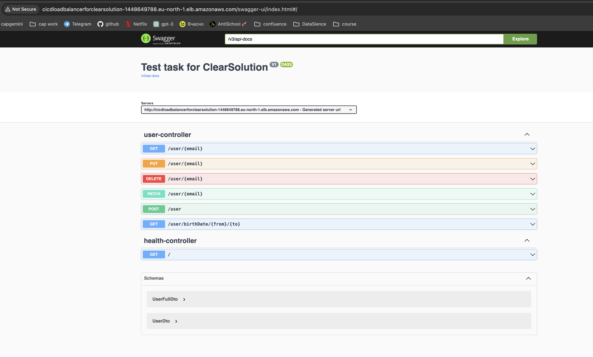
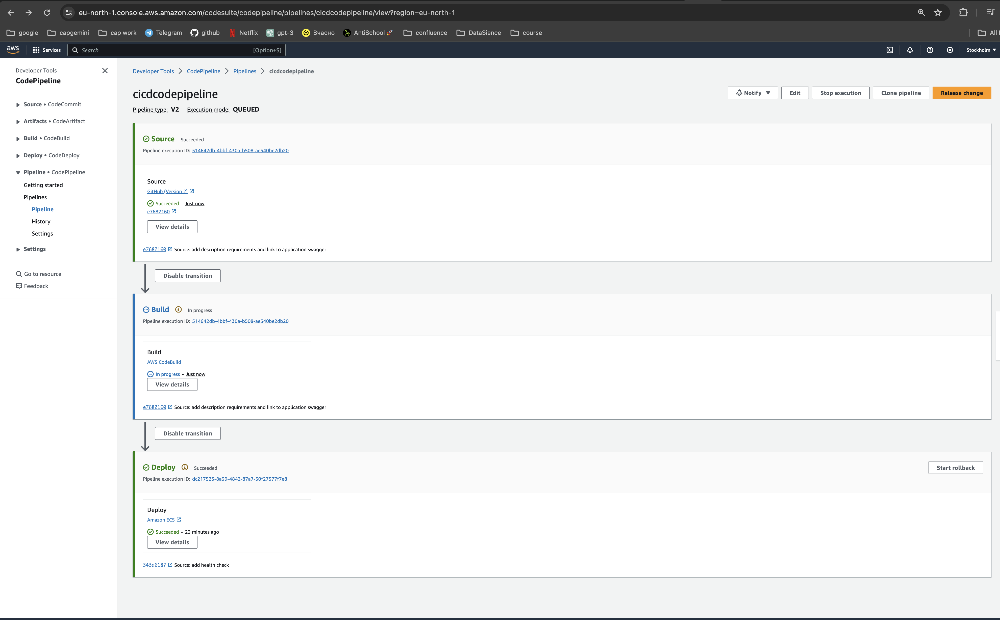
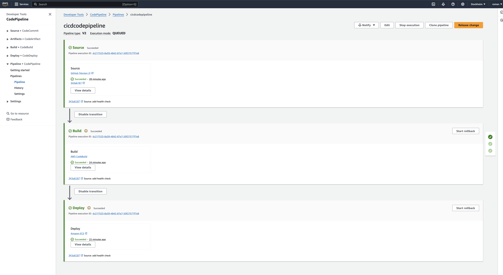

### Built CI/CD pipeline trigger by push commit [link](http://cicdloadbalancerforclearsolution-1448649788.eu-north-1.elb.amazonaws.com/swagger-ui/index.html#/)
#### Swagger


#### Triggered pipeline by git commit


#### Finished pipeline


Technical requirement

```
The task has two parts:
Java practical test assignment

1. Using the resources listed below learn what is RESTful API and what are the best practices to implement it
2. According to the requirements implement the RESTful API based on the web Spring Boot application: controller, responsible for the resource named Users.

Resources:
RESTful API Design. Best Practices in a Nutshell.
Error Handling for REST with Spring | Baeldung
Testing in Spring Boot | Baeldung
Testing | Spring

Requirements:
1. It has the following fields:
   1.1. Email (required). Add validation against email pattern
   1.2. First name (required)
   1.3. Last name (required)
   1.4. Birth date (required). Value must be earlier than current date
   1.5. Address (optional)
   1.6. Phone number (optional)
2. It has the following functionality:
   2.1. Create user. It allows to register users who are more than [18] years old. The value [18] should be taken from properties file.
   2.2. Update one/some user fields
   2.3. Update all user fields
   2.4. Delete user
   2.5. Search for users by birth date range. Add the validation which checks that “From” is less than “To”.  Should return a list of objects
3. Code is covered by unit tests using Spring
4. Code has error handling for REST
5. API responses are in JSON format
6. Use of database is not necessary. The data persistence layer is not required.
7. Any version of Spring Boot. Java version of your choice
8. You can use Spring Initializer utility to create the project: Spring Initializr

Please note:
we assess only those assignments where all requirements are implemented
```


Run Jenkins instance - ```docker-compose up -d```

Get password - ```docker exec jenkins cat /var/jenkins_home/secrets/initialAdminPassword```

Select `Install Suggested Plugins` on the next page. When Jenkins finishes, it will prompt you for a new admin user and password. Enter a user name and password and click Save and Continue.


# Pre-requirements:
 - Create EC2 instance (AIM should be `Amazon Linux 2 AMI (HVM) - Kernel 5.10, SSD Volume Type)` with security group (tcp 22, 80, 8080 to `0.0.0.0/0`)
 - Connect to EC2 by SSH

# Command

### Install Jenkins to 
I faced with error `The name org.freedesktop.PolicyKit1 was not provided by any .service files` long time but next order of command install jenkins (make sure that it works for clear and new EC2 instance)  

Update the installed packages and package cache on your instance.
`sudo yum update -y`

`sudo wget -O /etc/yum.repos.d/jenkins.repo https://pkg.jenkins.io/redhat-stable/jenkins.repo`

`sudo rpm --import https://pkg.jenkins.io/redhat-stable/jenkins.io-2023.key`

`sudo yum install java-17-amazon-corretto`

`sudo yum install polkit`

`sudo yum install jenkins`

`sudo service jenkins start`

### Install Git

`sudo yum install git`

Execute `which git`, copy result and go to `Manage Jenkins` -> `Tools` -> `Git installations` -> `Path to Git executable` paste result

### Install Docker to EC2 AWS instance

Install the most recent Docker Community Edition package.

`
sudo amazon-linux-extras install docker
`

Start the Docker service.

`sudo service docker start`

Add the ec2-user to the docker group so you can execute Docker commands without using sudo.

`sudo usermod -a -G docker ec2-user`

Log out and log back in again to pick up the new docker group permissions. You can accomplish this by closing your current SSH terminal window and reconnecting to your instance in a new one. Your new SSH session will have the appropriate docker group permissions.

Verify that the ec2-user can run Docker commands without sudo.

`docker info`

### Work with Jenkins
Get password for authorization
`sudo cat /var/lib/jenkins/secrets/initialAdminPassword`